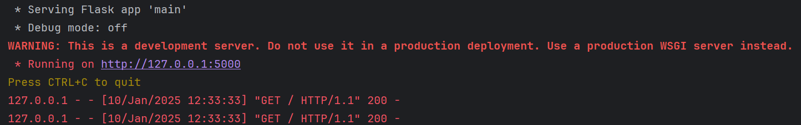
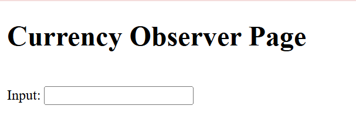
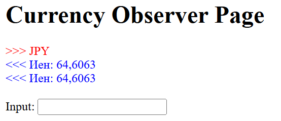

# Лабораторная работа №7. Использование шаблона «Наблюдатель».
## Выполнила: Гиниятуллина Юлия Сергеевна, 2.2.

В ходе выполнения лабораторной работы была создана программа, которая использует паттерн проектирования "Наблюдатель" для отслеживания изменений курсов валют через API Центробанка РФ. Программа запрашивает курсы валют и уведомляет зарегистрированных наблюдателей об изменении курсов в реальном времени.

Структура:

* Объект — веб-сервер Flask.
* Наблюдатели - клиенты, представляющие HTML-страницы, связывающиеся с объектом с помощью веб-сокетов.

Для попадания на сайт необходимо запустить файл ```main.py``` и перейти по ссылке: http://127.0.0.1:5000 

## Демонстрация работы:

До соответствующего скриншота в консоли выводятся все коды валют, чтобы пользователь мог прочитать список и выбрать любую. 



Главная страница сайта:



Отслеживание японских йен. Интервал между запросами - 10 секунд:
